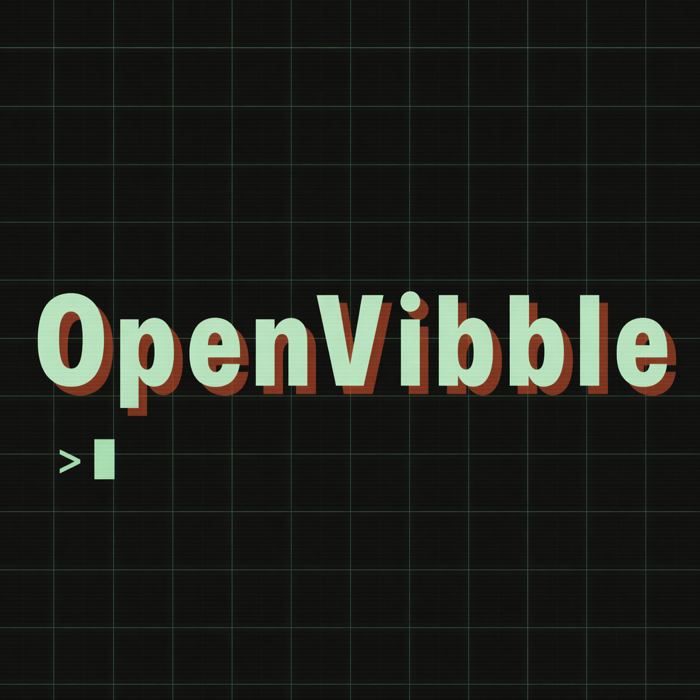

# OpenVibble · iOS Hardware Buddy Bridge

[English](./README.md) | [中文](./README.zh-CN.md)

<p align="center">
  
</p>

<p align="center">
  
  
</p>

OpenVibble 是一个 iPhone 应用，通过 BLE（Nordic UART Service）与 Claude Desktop 配对，作为 iOS 端的“Hardware Buddy”。

核心能力包括：
- 与 Claude Desktop Hardware Buddy 模式建立 BLE 连接
- 在手机端处理权限提示（批准/拒绝）
- 角色状态流转（idle/attention/busy/sleep/dizzy/celebrate/heart）
- 基于传感器的互动（摇一摇、设备朝下）
- 内置与桌面端下发的 GIF 角色包
- Live Activity 状态展示

## 环境要求

- macOS + Xcode 17+
- iOS 最低版本：18.0+
- [XcodeGen](https://github.com/yonaskolb/XcodeGen)
- 建议真机调试 BLE 外设广播（模拟器对 BLE 支持有限）

## 快速开始

```sh
make bootstrap
open OpenVibble.xcodeproj
```

命令行构建：

```sh
make build
```

运行测试：

```sh
make test
```

## 与 Claude Desktop 配对

1. 在 Claude Desktop 打开开发者模式，进入 `Developer -> Hardware Buddy`。
2. 在 iPhone 启动 OpenVibble，并授权蓝牙。
3. 保持蓝牙开启，在 Claude Desktop 中选择该设备完成连接。

说明：
- iOS 对 BLE/GAP 有系统级限制，部分 MCU 固件中的底层能力无法直接映射。
- 桌面端下发的角色包会保存在 App 沙盒目录，并自动出现在角色/物种选择中。

## 项目结构

- `OpenVibbleApp/`：iOS 主应用（界面、引导、设置、传感器、资源）
- `OpenVibbleLiveActivity/`：Live Activity 扩展
- `Packages/OpenVibbleKit/`：共享 Swift Package 模块
  - `BridgeRuntime`
  - `NUSPeripheral`
  - `BuddyProtocol`
  - `BuddyStorage`
  - `BuddyPersona`
  - `BuddyStats`
  - `BuddyUI`

## 常用命令

```sh
make bootstrap
make build
make test
make run-sim
make clean
```

## 本地化

当前提供英文（`en`）与简体中文（`zh-Hans`）资源。

## 许可证

使用 GNU AGPLv3，详见 [LICENSE](./LICENSE)。
