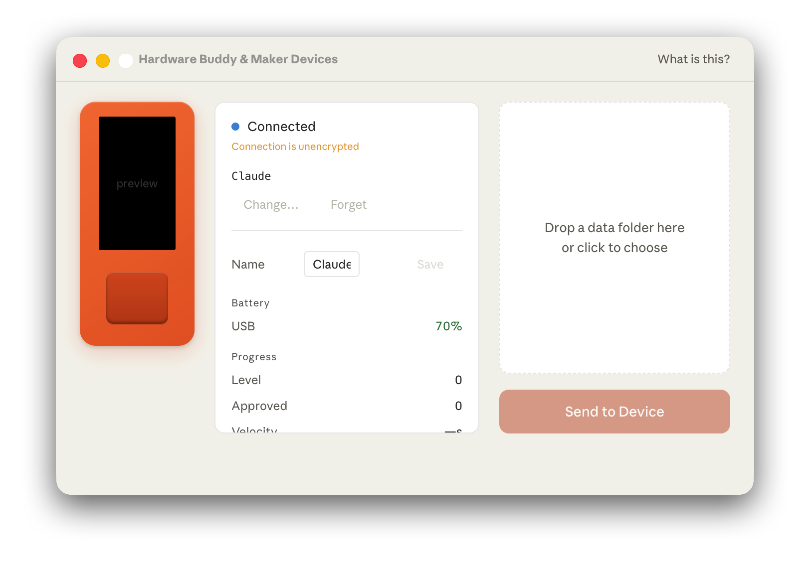
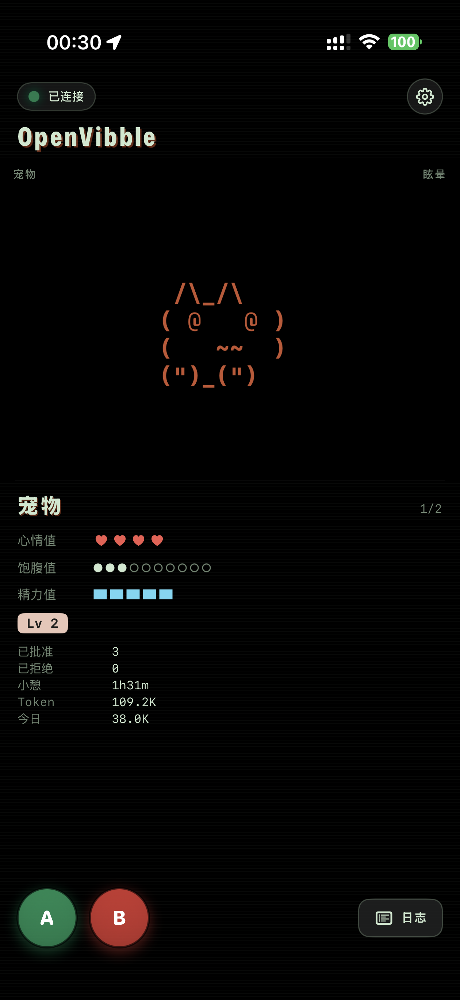
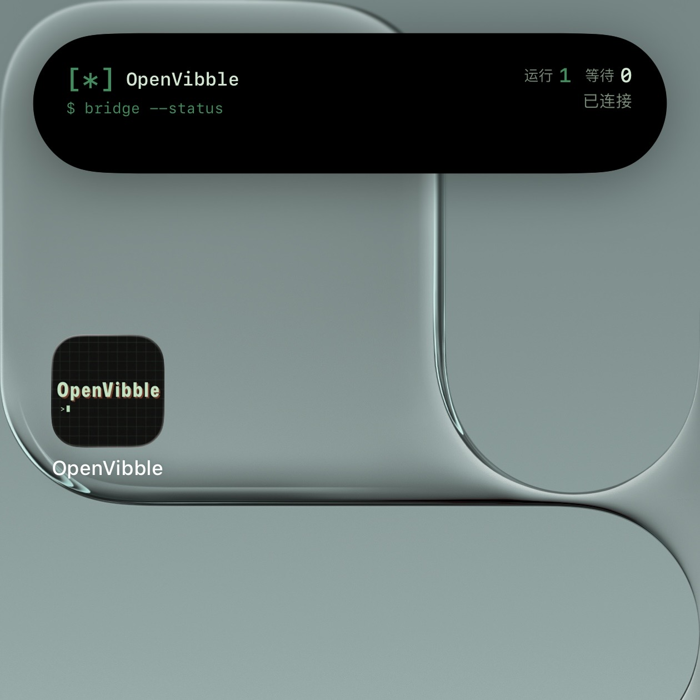

# OpenVibble

[English](./README.md) | 中文

<p align="center"><strong>M5Stack 开发板还在路上？先用 OpenVibble 体验起来！</strong></p>

<p align="center">
  
</p>

<p align="center">
  
  
  
  <a href="https://github.com/kingcos/OpenVibble/actions/workflows/build.yml">
    
  </a>
</p>

OpenVibble 基于 Claude Desktop Buddy 蓝牙协议实现，让 iPhone 或 Android 手机直接与 Claude Desktop 配对，复刻原版 M5Stack 固件能力；搭配配套的 macOS 应用 **OpenVibble Desktop**，还能进一步桥接 Claude Code 等 Agent。

它基于 [Claude Desktop Buddy](https://github.com/anthropics/claude-desktop-buddy)，提供 iOS、Android 与 macOS 桌面端的原生交互与运行时支持。

## 效果图

| Claude Desktop 连接成功 | iOS App | 灵动岛 |
| --- | --- | --- |
|  |  |  |

桌宠运行时常驻手机端，核心能力包括：
- 与 Claude Desktop Hardware Buddy 模式建立 BLE 连接
- 在手机端处理权限提示（批准 / 拒绝）
- 角色状态流转（idle / attention / busy / sleep / dizzy / celebrate / heart）
- 基于传感器的互动（摇一摇、设备朝下）
- 内置与桌面端下发的 GIF 角色包
- 灵动岛与实时活动（Live Activity）状态展示与交互
- Android 墨水屏友好的终端主题，以及中英文双语资源

## 环境要求

- iOS：macOS + Xcode 17+、iOS 18.0+、[XcodeGen](https://github.com/yonaskolb/XcodeGen)，并需要 iPhone 真机。
- Android：Android Studio Ladybug 或更新版本、JDK 17、Android 8.0+（API 26），并需要支持 BLE 5.0 的真机。
- 桌面桥接：**OpenVibble Desktop** 需要 macOS 14+。
- 模拟器适合检查 UI，但 BLE 外设广播必须使用真机。

## 快速开始

构建 iOS/macOS 工程：

```sh
make bootstrap
open OpenVibble.xcodeproj
```

命令行构建 iOS App：

```sh
make build
```

运行测试：

```sh
make test
```

构建 Android App：

```sh
cd android
./gradlew :app:assembleDebug
./gradlew test
```

debug APK 会输出到 `android/app/build/outputs/apk/debug/app-debug.apk`。正式 release 签名请使用你本地的 Android Studio / Gradle signing 配置。

## 与 Claude Desktop 配对

1. 在 Claude Desktop 通过 `Help -> Troubleshooting -> Enable Developer Mode` 开启开发者模式。
2. 打开 `Developer -> Open Hardware Buddy...`，点击 `Connect`，然后选择你的 iOS 或 Android 设备。
3. 在手机上启动 OpenVibble，并在提示时授权蓝牙。

说明：
- iOS 和 Android 对 BLE/GAP 都有系统级限制，部分 MCU 固件中的底层能力无法直接映射。
- 桌面端下发的角色包会保存在 App 沙盒目录，并自动出现在角色 / 物种选择中。

## 与 Claude Code 配对（通过 OpenVibble Desktop）

OpenVibble Desktop 是一个 macOS 配套应用，把 OpenVibble 桥接到 Claude Code，以及其它兼容相同 hook 协议的 Agent。

1. 在同一个 Xcode 工程中构建并运行 **OpenVibbleDesktop**。
2. 在 OpenVibble Desktop 打开 **Hooks** 标签页，注册 Claude Code hooks（会写入 `~/.claude/settings.json`，可随时撤销）。
3. 连接 iOS 或 Android 设备后，Claude Code 的会话事件（启动 / 终止、权限请求、回复完成、用户消息等）会实时转发到桌宠端。

## 贡献

欢迎提交 Issue 和 Pull Request。反馈问题时建议附上可复现步骤与环境信息。

## 本地化

iOS 与 Android 当前均提供英文（`en`）与简体中文（`zh-Hans` / `zh`）资源。

## 许可证

使用 Mozilla Public License 2.0，详见 [LICENSE](./LICENSE)。
